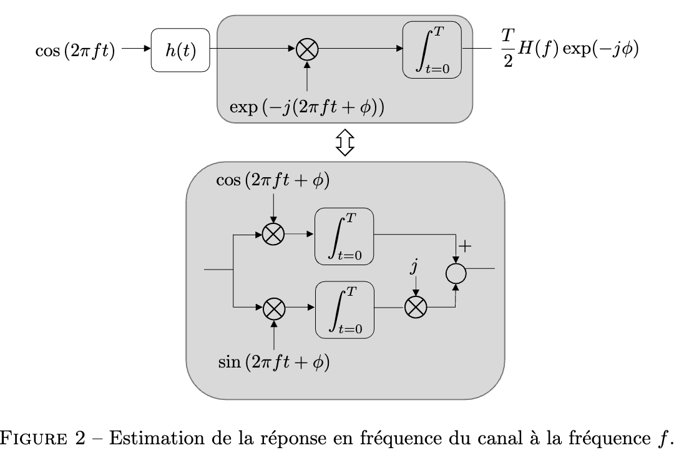
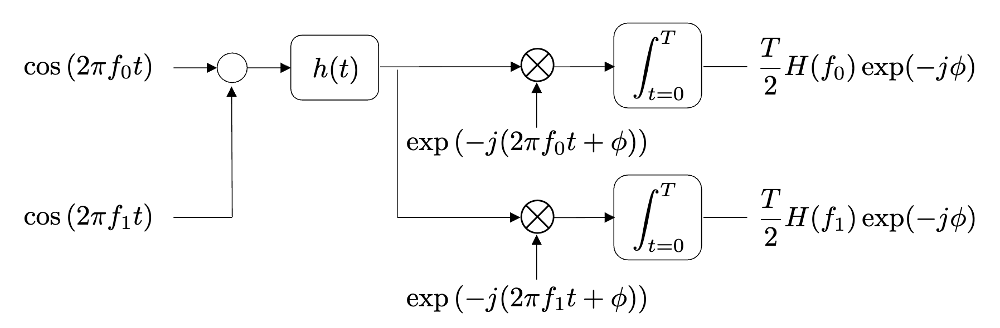

# Développements de l'étape 2

## Estimation de la réponse de canal à 1 fréquence

$$
\cos(2\pi ft) \otimes h(t) = y(t)
$$
$$
Y(f) = \int _{-\infty} ^{\infty} y(t) \cdot \exp(-j2\pi ft)dt
$$
$$
Y(f) = X(f)H(f)
$$
hypothèse : $h(t)$ causal et $x(t)=0, t<0$  et $x(t) = 0, t\geq T$
donc $y(t) = 0, t<0$ et $t>T$
donc 
$$\int _{-\infty} ^{\infty} y(t) \cdot \exp(-j2\pi ft)dt = \int _{t=0} ^{\infty} y(t) \cdot \exp(-j2\pi ft)dt$$
qui est presque l'intégrale calculée dans le block gris.
Prenons en comptes la borne supérieure $T$ :

avec
1. les hypothèse plus haut
2. que $fT=n \in\mathbb{N}$ donc on intègre sur un nombre de période entier $\sin(4\pi n)$ et $\cos(4\pi n)$
$$
\begin{align}
X(f) &= \int _{-\infty}^{\infty} \cos(2\pi ft)\exp(-j2\pi ft)dt \\
&\underbrace{ = }_{ 1 } \int _{0}^{T} \cos(2\pi ft) (\cos(-2\pi ft)-j\sin(2\pi ft))dt \\
&=\int _{0}^{T} \cos ^{2}(2\pi ft) - j\sin(2\pi ft)\cos(2\pi ft)dt \\
&=\int _{0}^{T} \frac{1+\cos(4\pi ft)}{2} -j \frac{\sin(4\pi ft)}{2}dt \\
&\underbrace{ = }_{ 2 } \int _{0}^{T} \frac{1}{2} dt = \frac{T}{2}
\end{align}
$$
avec les hypothèse plus haut (notamment = 0 si $t>T$) on a
$$
\begin{align}
Y(f) &= \int _{t=0} ^{T} y(t) \cdot \exp(-j2\pi ft)dt \\
\exp(-j\phi)Y(f) &= \exp(-j\phi) \int _{t=0} ^{T} y(t) \cdot \exp(-j2\pi ft)dt \\
&=\int _{t=0} ^{T} y(t) \cdot \exp(-j(2\pi ft+\phi))dt
\end{align}
$$
Donc il suffit de calculer $Y(f)$ pour finir de démontrer.
$$
\begin{align}
Y(f) &= X(f)H(f) \\
&= \frac{T}{2}H(f)
\end{align}
$$
enfin :
$$
\exp(-j\phi)Y(f) = \frac{T}{2}H(f)\exp(-j\phi)
$$

## Extension de la démo à n fréquences

Q : est-ce que c'est bon juste principe de superposition ça ?
R : non il faut montrer que quand on multiplie par un cos ça annule les autres et garde juste celui qui 

avec les fréquences assez espacées que pour ne pas se chevaucher en fréquentiel.

à creuser sur la partie du cours sur les signaux périodiques.

hypothèse : $h(t)$ causal et $x(t)=0, t<0$  et $x(t) = 0, t\geq T$
donc $y(t) = 0, t<0$ et $t>T$
donc on a à nouveau que les 2 branches évalue la FT de la sortie $y(t)$ du canal cette fois ci à 2 fréquences, $f_{0}$ et $f_{1}$ avec un déphasage qui ne change pas le canal
$$
\begin{align}
y(t)&=\overbrace{ (\cos(2\pi f_{0}t) + \cos(2\pi f_{1}t)) }^{ x(t) } \otimes h(t) \\
%&= (\cos(2\pi f_{0}t) \otimes h(t) ) + (\cos(2\pi f_{1}t)\otimes h(t))
\end{align}
$$
$$
Y(f) = X(f)H(f)
$$
il rest à calculer $X$ en $f_{0}$ et $f_{1}$
$$
\begin{align}
X(f_{0}) &= \int _{0}^{T} (\cos(2\pi f_{0}t) + \cos(2\pi f_{1}t)) \exp(-j2\pi f_{0}t)dt \\
&=\int _{0}^{T}     (\cos(2\pi f_{0}t) + \cos(2\pi f_{1}t)) \cdot \\&\qquad \quad(\cos(-2\pi f_{0}t)-j\sin(2\pi f_{0}t))dt \\
&=\int _{0}^{T} [\cos ^{2}(2\pi f_{0}t) - j\sin(2\pi f_{0}t)\cos(2\pi f_{0}t)  \\
&\qquad \quad + \cos(2\pi f_{1}t)\cos(2\pi f_{0}t) - j\cos(2\pi f_{1}t)\sin(2\pi f_{0}t)]dt \\
&=\int _{0}^{T} [ \frac{1+\cancel{ \cos(4\pi f_{0}t) }}{2} \cancel{ - j \frac{\sin(4\pi f_{0}t)}{2} }  \\
&\qquad \quad+ \frac{1}{2}[\cos(2\pi (f_{1}-f_{0})t) + \cos(2\pi(f_{1}+f_{2})t)]  \\
&\qquad\quad - j \frac{1}{2}[\sin(2\pi(f_{1}-f_{0})t)+ \sin(2\pi(f_{1}+f_{0})t)] ]dt
\end{align}
$$
s'annule car fonction périodique de moyenne nulle sur 1 période (en effet $f_{0}$ et $f_{1}$ multiples entier de $\frac{1}{T}$) *(on aurait pu séparer l'intégrale et directement utiliser le résultat précédent)* et en utilisant les formules de simpsons.
On a que $f_{0}-f_{1} = \frac{n}{T},\ f_{0}+f_{1} = m\ | \ n,m\in\mathbb{Z}_{0}$ donc ce sont aussi des intégrales sur une période de fonction périodique de moyenne nulle.
finalement :
$$
= \int _{0}^{T} \frac{1}{2} dt = \frac{T}{2}
$$
donc $Y(f_{0})=\frac{T}{2}H(f_{0})$ *+ ajouter le déphasage*
## partie 2

Déterminer le paramètre d'écart $T$, mesurer l'étalement fréquentiel d'une sinusoide pour avoir un écart suppérieur à cet étalement.

faire une mesure à vide du bruit spectre de bruit ambiant.
-> choisir une plage de fréquence peu affectée, => au dessus de 2000.

Notre signal est une fenêtre rect multipliée par un sinus -> FT est un sync -> calculer et mesurer 
l'étalement de celui-ci. (à voir parce que les math au dessus semblent dire qu'il ne devrait pas avoir d'interférences ??)
choisir l'espacement en fonction de l'étalement en fréquence

pour $T$ assez court pour que la mesure soit rapide. Mais plus il est court moins on peut être précis au niveau de l'écart entre les fréquences.

$$
f_k = \frac{n_0+n_1\cdot k}{T}
$$
où : 
- $n_0$ donne la fréquence min
- $n_1$ détermine l'espacement entre les fréquences succesives

bonus : si c'est peu audible c'est cool

## partie 3
$$
\begin{align}
|H(f)|& = \sqrt{ Re[ H(f) ]^{2} +Im[H(f)]^{2} } \\
&= \sqrt{ \begin{gather}
(\alpha_{d}\cos(2\pi f\tau_{d}) + \alpha_{r}\cos(2\pi f\tau_{r})) ^{2} \\+ (\alpha_{d}\sin(2\pi f\tau_{d}) + \alpha_{r}\sin(2\pi f\tau_{r})) ^{2}
\end{gather}} \\
&=\sqrt{ \begin{align}
\alpha_{d}^{2}+\alpha_{r}^{2} + 2\alpha_{d}\alpha_{r}[&\cos(2\pi f\tau_{d})\cos(2\pi f\tau_{r}) \\
&+\sin(2\pi f\tau_{d})\sin(2\pi f\tau_{r})]
\end{align} } \\
&= \sqrt{ \alpha_{d}^{2}+\alpha_{r}^{2} + 2\alpha_{d}\alpha_{r}\cos(2\pi f(\tau_{r}-\tau_{d})) }
\end{align}
$$
+illustrer le résultat. 
paramètres raisonnables : 
$$
\tau_{r} = 2\cdot \frac{d_{m}}{v}, \quad \tau_{d} = \frac{d_{d}}{v}
$$
où $d_{m}$ est la distance mesurée et $d_{d}$ est la distance directe ($\approx 15cm$) et $v \approx 340m/s$ 
prenons $d_{m}=2m$, $\alpha_{d} \approx 0.5$ and $\alpha_{r} \approx 0.1$

voir `frequencyResponseModel.m`

## Partie 4

