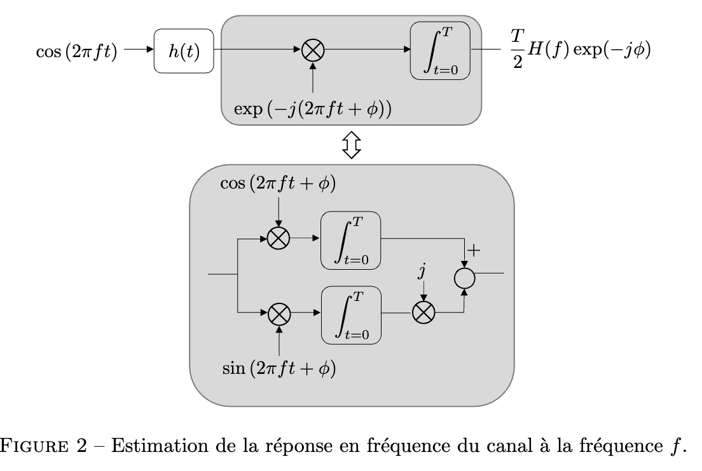

# Pour info : objectifs du cahier des charges
- Etudier les propriétés de la modulation en fréquence et comprendre son intérêt dans le cas des systèmes de communications et de sensing. Nous supposerons que les deux fonctionnalités sont opérées avec le même type de signal, mais qu'elles se déroulent séquentiellement.
- Concevoir et analyser un système de sensing basé sur la mesure en fréquence du canal de propagation des ondes. Mettre le système en oeuvre avec des signaux audio afin de mesurer de la distance entre un ordinateur et un mur.
- Concevoir et analyser une chaîne de communications à modulation numérique en fréquence. Mettre le système en oeuvre avec des signaux audio afin de communiquer une image entre deux ordinateurs.
- Réaliser la simulation des deux systèmes à l'aide du logiciel Matlab afin d'étudier leur performance en présence de bruit blanc additif Gaussien.
- Plus généralement, se familiariser avec les notions fondamentales de télécommunications, telles que la bande passante, la densité spectrale de puissance, le bruit blanc additif Gaussien, le récepteur par corrélation...

# Introduction

# Step 1 - Mark

# Step 2 - Antoine

## Estimation de la réponse de canal à 1 fréquence

\label{estimation canal 1 freq} 

Démonstration rigoureuse du principe d'estimation de la réponse du canal à une fréquence : 

La sortie du canal $y(t)$ est la convolution du signal émit $x(t)=\cos(2\pi ft)$ et de la réponse impulsionnelle $h(t)$ :
$$
y(t) = \cos(2\pi ft) \otimes h(t) 
$$
Supposons que $h(t)$ soit causal et que $x(t)=0,\ \text{pour } t\notin [0,T]$ 
donc $y(t) = 0$ pour $t\notin [0,T]$ (où $T=\frac{n}{f},\ n\in\mathbb{N}_{0}$).

On a donc que l'intégrale calculée dans la figure \ref{estimation canal 1 freq} est équivalente à : (en prenant $\phi=0$)
$$
\begin{align}
\int_{0}^{T}y(t)\exp(-j2\pi ft)dt = \int_{-\infty}^{\infty}y(t)\exp(-j2\pi ft)dt &=: \mathcal{F}(y(t)) \\
&:=Y(t)
\end{align}
$$
donc avec la propriété de la transformée de Fourier d'une convolution : 
$$
Y(f) = \mathcal{F}(x(t) \otimes h(t)) = X(f)H(f)
$$
Il reste donc à calculer $X(f)$ pour connaitre $Y(f)$ :
$$
\begin{align}
X(f) &= \int _{-\infty}^{\infty} \cos(2\pi ft)\exp(-j2\pi ft)dt \\
&\underbrace{ = }_{ 1 } \int _{0}^{T} \cos(2\pi ft) (\cos(-2\pi ft)-j\sin(2\pi ft))dt \\
&=\int _{0}^{T} \cos ^{2}(2\pi ft) - j\sin(2\pi ft)\cos(2\pi ft)dt \\
&=\int _{0}^{T} \frac{1+\cos(4\pi ft)}{2} -j \frac{\sin(4\pi ft)}{2}dt \\
&\underbrace{ = }_{ 2 } \int _{0}^{T} \frac{1}{2} dt = \frac{T}{2}
\end{align}
$$
avec
1. les hypothèse sur $x(t)$ plus haut : $x(t)=0,\ \text{pour } t\notin [0,T]$
2. que $fT=n \in\mathbb{N}_{0}$ donc on intègre sur un nombre de période entier $\sin(4\pi n)$ et $\cos(4\pi n)$

Enfin on peut réintroduire le déphasage potentiel : 
$$
\begin{align}
Y(f) &= \int _{t=0} ^{T} y(t) \cdot \exp(-j2\pi ft)dt \\
\exp(-j\phi)Y(f) &= \exp(-j\phi) \int _{t=0} ^{T} y(t) \cdot \exp(-j2\pi ft)dt \\
&=\int _{t=0} ^{T} y(t) \cdot \exp(-j(2\pi ft+\phi))dt
\end{align}
$$

enfin en grâce aux 3 résultats précédents ensembles :
$$
\exp(-j\phi)Y(f) = \frac{T}{2}H(f)\exp(-j\phi)
$$
on peut utiliser la réponse à une exponentielle complexe.
Donc comme cos est une somme d'exp.

## Extension de la démo à n fréquences

Q : est-ce que c'est bon juste principe de superposition ça ?
R : non il faut montrer que quand on multiplie par un cos ça annule les autres et garde juste celui qui 

avec les fréquences assez espacées que pour ne pas se chevaucher en fréquentiel.

à creuser sur la partie du cours sur les signaux périodiques.

hypothèse : $h(t)$ causal et $x(t)=0, t<0$  et $x(t) = 0, t\geq T$
donc $y(t) = 0, t<0$ et $t>T$
donc on a à nouveau que les 2 branches évalue la FT de la sortie $y(t)$ du canal cette fois ci à 2 fréquences, $f_{0}$ et $f_{1}$ avec un déphasage qui ne change pas le canal
$$
\begin{align}
y(t)&=\overbrace{ (\cos(2\pi f_{0}t) + \cos(2\pi f_{1}t)) }^{ x(t) } \otimes h(t) \\
%&= (\cos(2\pi f_{0}t) \otimes h(t) ) + (\cos(2\pi f_{1}t)\otimes h(t))
\end{align}
$$
$$
Y(f) = X(f)H(f)
$$
il rest à calculer $X$ en $f_{0}$ et $f_{1}$
$$
\begin{align}
X(f_{0}) &= \int _{0}^{T} (\cos(2\pi f_{0}t) + \cos(2\pi f_{1}t)) \exp(-j2\pi f_{0}t)dt \\
&=\int _{0}^{T}     (\cos(2\pi f_{0}t) + \cos(2\pi f_{1}t)) \cdot \\&\qquad \quad(\cos(-2\pi f_{0}t)-j\sin(2\pi f_{0}t))dt \\
&=\int _{0}^{T} [\cos ^{2}(2\pi f_{0}t) - j\sin(2\pi f_{0}t)\cos(2\pi f_{0}t)  \\
&\qquad \quad + \cos(2\pi f_{1}t)\cos(2\pi f_{0}t) - j\cos(2\pi f_{1}t)\sin(2\pi f_{0}t)]dt \\
&=\int _{0}^{T} [ \frac{1+\cancel{ \cos(4\pi f_{0}t) }}{2} \cancel{ - j \frac{\sin(4\pi f_{0}t)}{2} }  \\
&\qquad \quad+ \frac{1}{2}[\cos(2\pi (f_{1}-f_{0})t) + \cos(2\pi(f_{1}+f_{2})t)]  \\
&\qquad\quad - j \frac{1}{2}[\sin(2\pi(f_{1}-f_{0})t)+ \sin(2\pi(f_{1}+f_{0})t)] ]dt
\end{align}
$$
s'annule car fonction périodique de moyenne nulle sur 1 période (en effet $f_{0}$ et $f_{1}$ multiples entier de $\frac{1}{T}$) *(on aurait pu séparer l'intégrale et directement utiliser le résultat précédent)* et en utilisant les formules de simpsons.
On a que $f_{0}-f_{1} = \frac{n}{T},\ f_{0}+f_{1} = m\ | \ n,m\in\mathbb{Z}_{0}$ donc ce sont aussi des intégrales sur une période de fonction périodique de moyenne nulle.
finalement :
$$
= \int _{0}^{T} \frac{1}{2} dt = \frac{T}{2}
$$
donc $Y(f_{0})=\frac{T}{2}H(f_{0})$ *+ ajouter le déphasage*

attention généraliser à n fréquences
## partie 2

Déterminer le paramètre d'écart $T$, mesurer l'étalement fréquentiel d'une sinusoide pour avoir un écart suppérieur à cet étalement.

faire une mesure à vide du bruit spectre de bruit ambiant.
-> choisir une plage de fréquence peu affectée, => au dessus de 2000. 

Notre signal est une fenêtre rect multipliée par un sinus -> FT est un sync -> calculer et mesurer. (voir `sync_width.m`) On peut voir que l'étalement est pratiquement null.
l'étalement de celui-ci. (à voir parce que les math au dessus semblent dire qu'il ne devrait pas avoir d'interférences ??)
choisir l'espacement en fonction de l'étalement en fréquence (plus limité par micro/hautparleur qui sature)
Correction : uniquement qu'il faut que ça soit un multiple de 1/T

pour $T$ assez court pour que la mesure soit rapide. Mais plus il est court moins on peut être précis au niveau de l'écart entre les fréquences.

$$
f_k = \frac{n_0+n_1\cdot k}{T}
$$
où : 
- $n_0$ donne la fréquence min
- $n_1$ détermine l'espacement entre les fréquences succesives

bonus : si c'est peu audible c'est cool

## partie 3
$$
\begin{align}
|H(f)|& = \sqrt{ Re[ H(f) ]^{2} +Im[H(f)]^{2} } \\
&= \sqrt{ \begin{gather}
(\alpha_{d}\cos(2\pi f\tau_{d}) + \alpha_{r}\cos(2\pi f\tau_{r})) ^{2} \\+ (\alpha_{d}\sin(2\pi f\tau_{d}) + \alpha_{r}\sin(2\pi f\tau_{r})) ^{2}
\end{gather}} \\
&=\sqrt{ \begin{align}
\alpha_{d}^{2}+\alpha_{r}^{2} + 2\alpha_{d}\alpha_{r}[&\cos(2\pi f\tau_{d})\cos(2\pi f\tau_{r}) \\
&+\sin(2\pi f\tau_{d})\sin(2\pi f\tau_{r})]
\end{align} } \\
&= \sqrt{ \alpha_{d}^{2}+\alpha_{r}^{2} + 2\alpha_{d}\alpha_{r}\cos(2\pi f(\tau_{r}-\tau_{d})) }
\end{align}
$$
+illustrer le résultat. 
paramètres raisonnables : 
$$
\tau_{r} = 2\cdot \frac{d_{m}}{v}, \quad \tau_{d} = \frac{d_{d}}{v}
$$
où $d_{m}$ est la distance mesurée et $d_{d}$ est la distance directe ($\approx 15cm$) et $v \approx 340m/s$ 
prenons $d_{m}=2m$, $\alpha_{d} \approx 0.5$ and $\alpha_{r} \approx 0.1$

voir `frequencyResponseModel.m`

## Partie 4

voir `step2.m` pour la vérification exprérimentale

On l'a fait à la BST au bord d'une table avec un tableau blanc à $\pm 0.5m$ de distance. (d'autres réflecteurs se trouvaient à moins de $1m50$)

ça n'as pas été extrêmement conclusif (mais on a appris qu'il fallait normaliser le signal.)

à $2000Hz$ jusqu'à $2600$ avec une fréquence toutes les $50Hz$ on a observé une sinusoïde de période +- 300 ce qui correspond à la simulation pour ce genre de distances. (on a pas réussi à reproduire à d'autres fréquences et mettre plus de fréquence en même temps atteingnait  les limites du hardware => faire le truc de phase aléatoire.)

avec phase aléatoires : résultat très probant => voir figure `CanalResponse50cmRandomPhase-AntMac-f0=0-n1=5-kmax=4000.fig`

# Step 3 - Mark

# Step 6 - Mark

# Step 4 - Antoine

# Step 5 - Antoine

# Step 7 - Antoine

